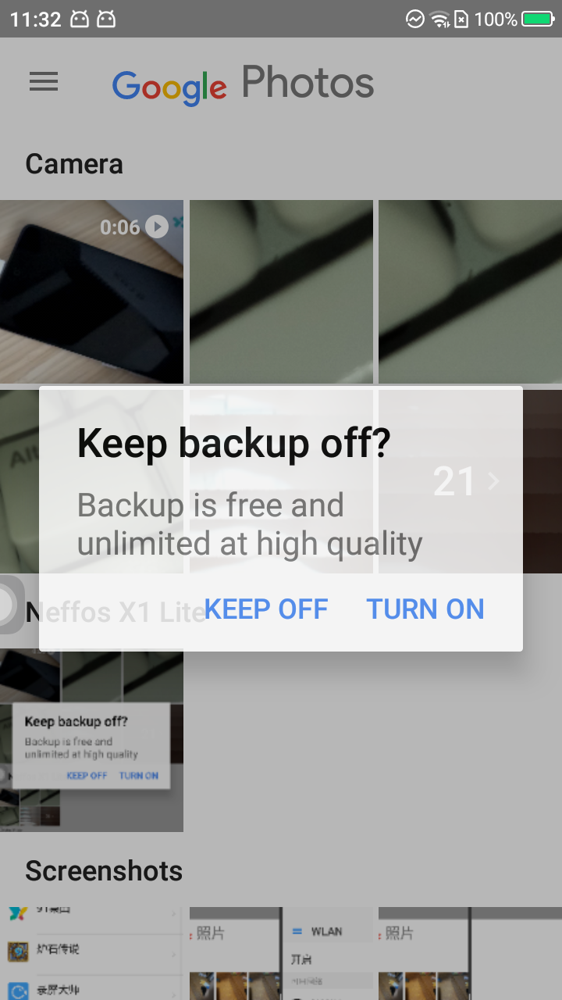

alsdkjhalkjdf
===============

hahahahhaha

::

    class Weather(BaseWeather):

        # page object
        def __init__(self, driver, **keyword):
            super(Weather, self).__init__(driver, **keyword)

            # page init
            self.base_weather_page = BaseWeatherPage(self)

            self.city_list_page = CityListPage(self)
            self.add_city_page = AddCityPage(self)
            self.setting_page = SettingPage(self)
            self.widget_page = WidgetPage(self)
            self.weather_main_page = WeatherMainPage(self)

